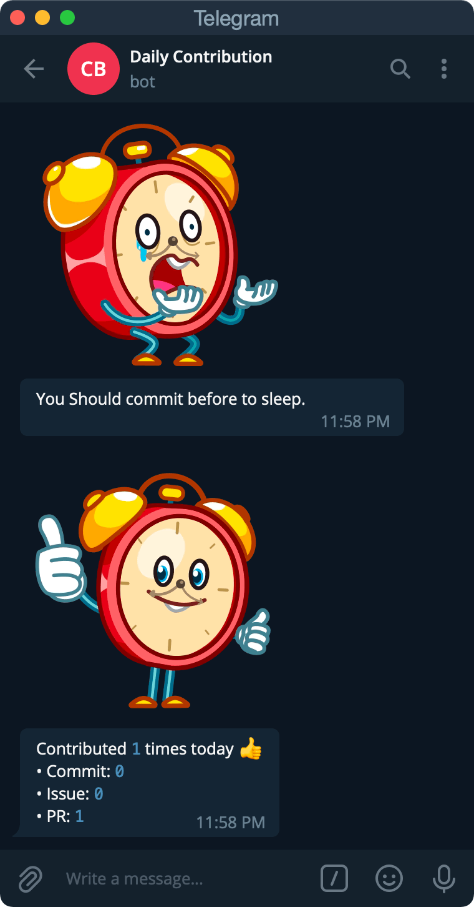

# DailyCommit
Commmmmmm~~with me!~~it every day!

**[@minggrammer](https://github.com/minggrammer)**님의 슬랙 봇인 [commit-alarm](https://github.com/geekhub-lab/commit-alarm)을 텔레그램으로 포팅한 챗봇입니다.

## How to run this chat bot?
### ~~run `install.sh`~~
[TODO: Fix `config.ini` paser bug..](https://github.com/MuhunKim/DailyCommit/blob/master/index.py#L25)

### \#1 `pip install -r requirements.txt`

### \#2 Edit the line

##### [44](https://github.com/MuhunKim/DailyCommit/blob/master/index.py#L44) : (Telegram)`bot_token`

##### [102](https://github.com/MuhunKim/DailyCommit/blob/master/index.py#L102) : (Github) `username`, `password`

##### [110](https://github.com/MuhunKim/DailyCommit/blob/master/index.py#L110) : (Telegram user) `tele_id`

### \#3 run `python index.py`
